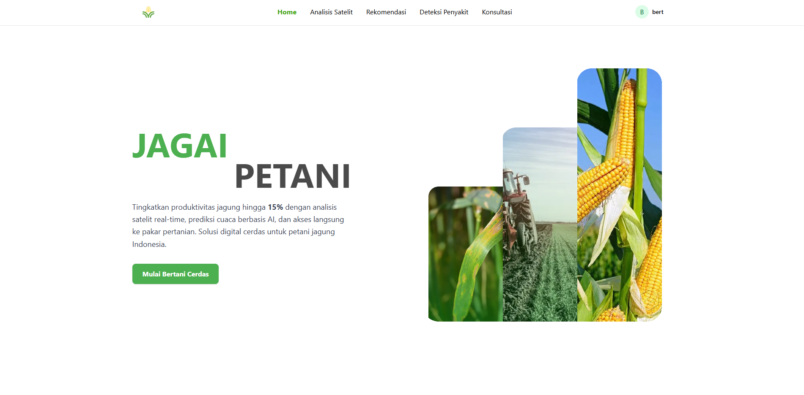

# 🌱 JagAI — Sistem Pendukung Keputusan Pertanian Pintar (Frontend)

JagAI adalah aplikasi web interaktif berbasis **Next.js** yang dirancang untuk membantu petani dan praktisi pertanian dalam **mendeteksi penyakit tanaman**, **mendapatkan rekomendasi perawatan**, serta **mengakses layanan konsultasi dengan pakar**.
Proyek ini merupakan bagian **frontend** dari sistem JagAI yang berfokus pada antarmuka pengguna, interaksi, dan pengalaman visual.



---

## 📋 Daftar Isi

- [✨ Fitur Utama](#-fitur-utama)
- [🖥️ Teknologi yang Digunakan](#️-teknologi-yang-digunakan)
- [📂 Struktur Direktori](#-struktur-direktori)
- [⚙️ Instalasi & Menjalankan Proyek](#️-instalasi--menjalankan-proyek)

---

## ✨ Fitur Utama

### 1. **Autentikasi & Otorisasi**

- Login & register dengan role **PETANI** atau **PAKAR**

### 2. **Deteksi Penyakit Tanaman**

- Upload foto daun jagung secara langsung
- Analisis otomatis oleh backend JagAI
- Menampilkan hasil deteksi lengkap:
  - Jenis penyakit
  - Tingkat infeksi
  - Keterangan detail
  - Panduan pengobatan & peringatan penting

### 3. **Rekomendasi Pemupukan**

- Rekomendasi perawatan tanaman berbasis data cuaca & kondisi lahan
- Tampilan kartu rekomendasi dengan desain interaktif

### 4. **Konsultasi dengan Pakar**

- Pencarian & filter praktisi berdasarkan lokasi, harga, dan rating
- Tampilan grid responsif dengan foto, profil singkat, dan tombol kontak WhatsApp

### 5. **Dashboard & Statistik**

- Informasi cuaca terkini
- Data kondisi tanaman, tanggal tanam, estimasi panen
- Navigasi cepat ke fitur inti

---

## 🖥️ Teknologi yang Digunakan

| Kategori        | Teknologi                         |
| --------------- | --------------------------------- |
| **Framework**   | [Next.js 15](https://nextjs.org/) |
| **Bahasa**      | TypeScript                        |
| **Styling**     | Tailwind CSS, shadcn/ui           |
| **HTTP Client** | Axios                             |

---

## 📂 Struktur Direktori

```plaintext
src/
 ├── app/                # Halaman Next.js (App Router)
 ├── components/         # Komponen UI dan halaman
 ├── hooks/              # Custom hooks (auth store, dll.)
 ├── api/                # Konfigurasi Axios
 ├── public/             # Asset publik (gambar, ikon)
```

## 📦 Instalasi & Menjalankan Proyek

### 1. Clone repository

```bash
git clone https://github.com/AlbertChoe/jag-ai-fe.git
cd jag-ai-fe
```

### 2. Install dependencies

```bash
npm install
```

### 3. Setup environment

#### Buat file .env.local di root proyek:

```bash
NEXT_PUBLIC_API_BASE_URL=<BACKEND_ENDPOINT>
```

### 4. Jalankan aplikasi

```bash
npm run dev
```

Akses di http://localhost:3000
